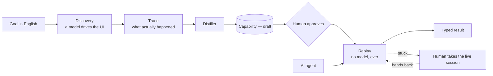
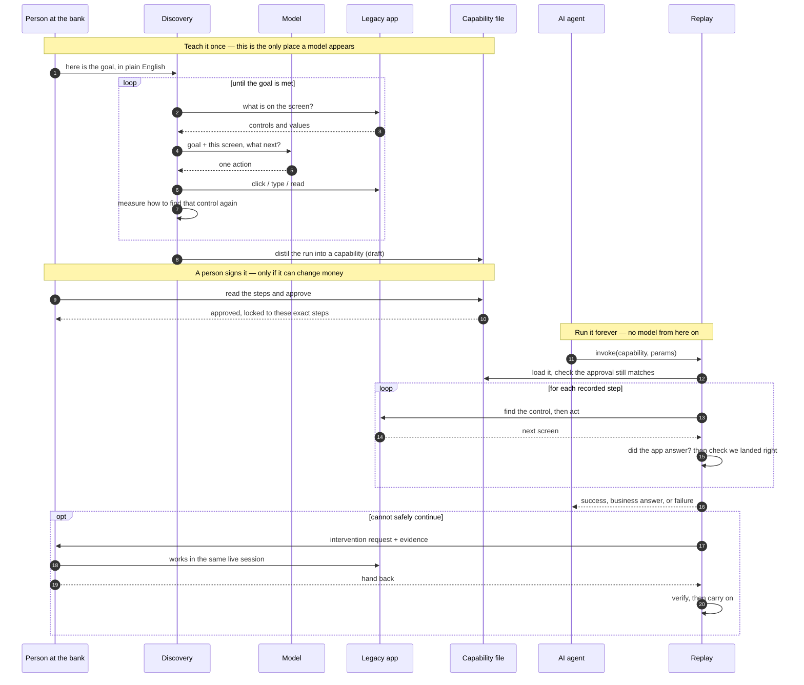
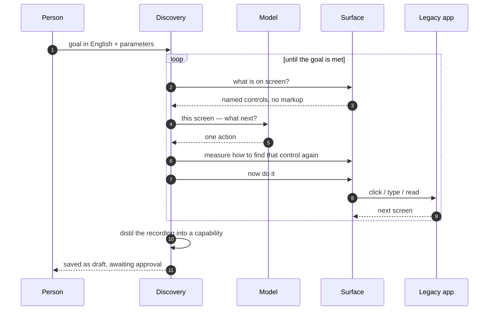
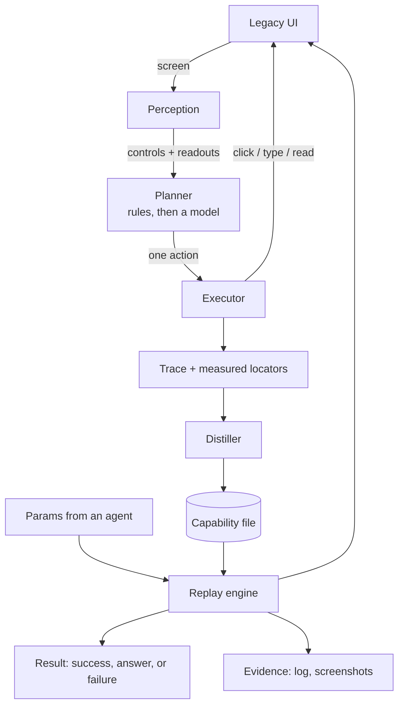
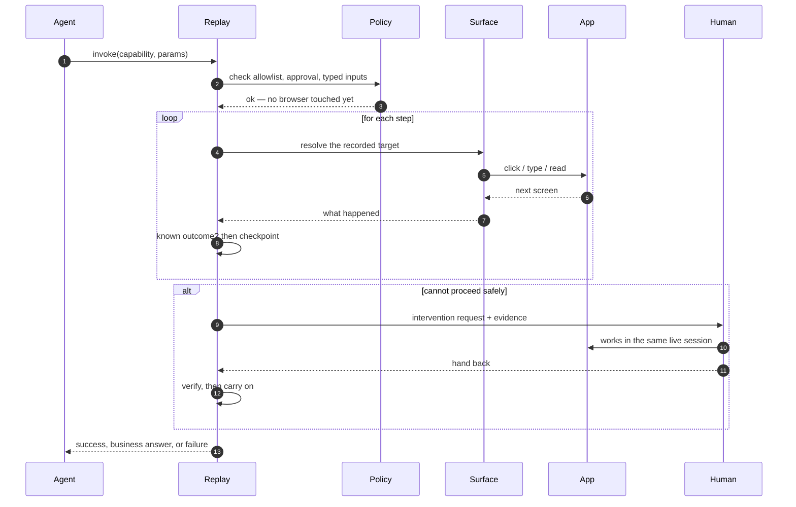

# aihands

Give an AI agent hands: let a model work out how to do a job inside a UI that has no API,
save what it did as a reusable capability, then run that capability from then on with no
model in the loop at all.

The target here is a credit union back-office desk I wrote for this — server-rendered, a
real `<frameset>`, no test ids, and records that misbehave on purpose. Two institutions run
it with different branding, which is how the cross-tenant story gets exercised rather than
described.

---

## Setup

Python 3.11+.

```bash
python3 -m venv .venv && source .venv/bin/activate
pip install -e ".[dev]"
playwright install chromium

cp .env.example .env        # put your OPENAI_API_KEY in it; .env is gitignored
```

The key is needed for **discovery only**. Replay never reads it, and there is a test that
walks the import graph to prove the replay path cannot reach a model client at all.

### Start the two institutions

```bash
aihands app --tenant mendota  --port 8099   # Lake Mendota Credit Union   (Madison, WI)
aihands app --tenant presidio --port 8098   # Presidio Federal CU         (San Francisco)
```

Sign in with any operator id, e.g. `OP-77`. Reset the seeded data any time:

```bash
curl -X POST http://127.0.0.1:8099/admin/reset
```

### Records that misbehave, on purpose

| member | what it does |
|---|---|
| `M-1001` | the happy path |
| `M-1002` | frozen — servicing is refused |
| `M-1003` | already has a savings sub-account, so the goal is already met |
| `M-1004` | first record load 503s, the second works |
| `M-1005` | fund it over the threshold and a second approver is demanded |
| `M-9999` | does not exist |

Deposits under $25 are rejected. `POST /admin/expire` kills the session mid-flow.

---

## The demo path

Four commands, start to finish.

**1. Discover — a model drives the real UI**

```bash
aihands discover \
  --goal "Sign in to the servicing desk, find the member with the given member id, and open \
a savings sub-account for them with the given opening deposit. Then read the confirmation \
number from the receipt." \
  --entry-url http://127.0.0.1:8099/login \
  --param operator_id=OP-77 --param member_id=M-1001 --param deposit=500 \
  --output confirmation_number \
  --planner ladder \
  --distill-to mendota.member.open_savings_subaccount \
  --name "Open a savings sub-account for a member" \
  --description "Finds a member and opens a savings sub-account, returning the confirmation number."
```

`--planner llm` makes every decision a model decision. `--planner heuristic` uses only rules
and needs no API key, which is how the whole pipeline stays runnable in CI. Every artifact
records which tiers decided which steps, so an offline run can never be mistaken for a
model-driven one.

**2. Approve — because it changes state**

It comes out as `draft`. A capability that only reads replays freely; one that can open an
account needs a person to read it first.

```bash
aihands approve mendota.member.open_savings_subaccount --by you@example.com
```

**3. Replay — with parameters the recording never saw, and no model**

```bash
aihands replay mendota.member.open_savings_subaccount \
  --param operator_id=OP-77 --param member_id=M-1005 --param deposit=750 --allow-risky
```

**4. Run the same artifact against the other institution**

```bash
aihands replay mendota.member.open_savings_subaccount --tenant presidio \
  --param operator_id=OP-77 --param member_id=M-1001 --param deposit=500 --allow-risky
```

Try `M-9999` for a business answer, `M-1004` for a transient it recovers from, and
`--param deposit=15000` for the one that stops and asks for a human.

### Console and agent API

```bash
aihands console          # http://127.0.0.1:8100
```

The catalogue at `GET /api/capabilities` emits JSON Schema for inputs and outputs, so a
capability is directly usable as a tool definition. `POST /api/capabilities/{id}/invoke`
runs one. Add `"attended": true` and a stuck run waits for a person instead of returning an
intervention request.

### Tests and evidence

```bash
pytest -q                          # 241 tests
python scripts/make_evidence.py    # regenerates everything in evidence/ from real runs
```

---

## How it works



Discovery is expensive and runs once per capability. Replay is free and runs forever. The
file in the middle is the product.

### The whole system, start to finish



Steps 1–9 happen once per capability and cost a few cents. Steps 10–11 are a
person reading what the model wrote. Steps 12–17 are what runs in production,
thousands of times, for nothing.

### Teaching it a job (discovery)



Step 6 is the one that matters: we measure how to find that control again *before* acting
on it, because a click navigates away and the element is gone. A description we never tried
is a guess.

### Where the data goes



### One invocation, end to end



The design decisions, the trade-offs, and the things I got wrong are in
[REPORT.md](REPORT.md). Real output from real runs is in [evidence/](evidence/).

---

## Layout

```
target_app/            the stand-in: two credit unions, one legacy codebase
policy.yaml            the deployment allowlist. The agent cannot touch it.
capabilities/          artifacts, plus per-app outcomes and per-tenant overlays
src/aihands/
  schema/              capability, outcomes, results, bindings — imports no browser
  kernel/              policy, control, redaction, evidence
  surface/             perception + Playwright — the only place a browser exists
  discovery/           planner, loop, distiller — the only place a model exists
  replay/              the production path
  api/                 agent API + operator console
evidence/runs/         committed output from real runs
```
