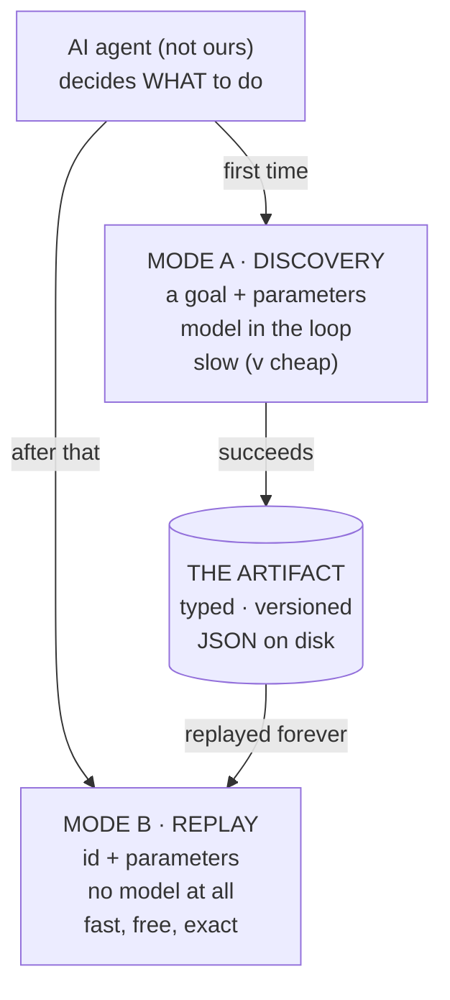
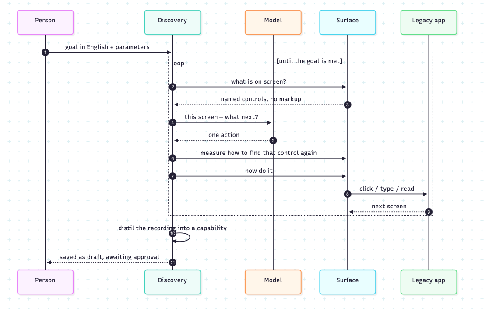
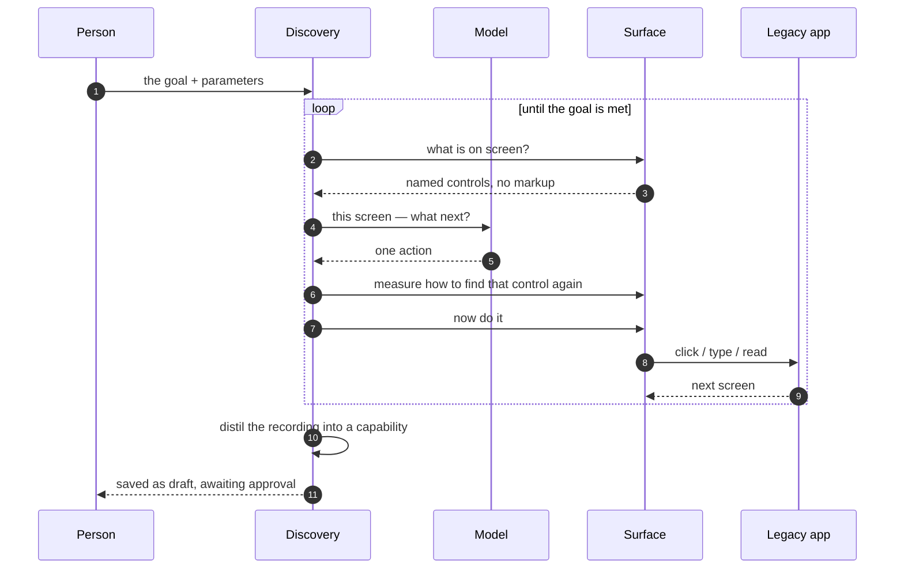
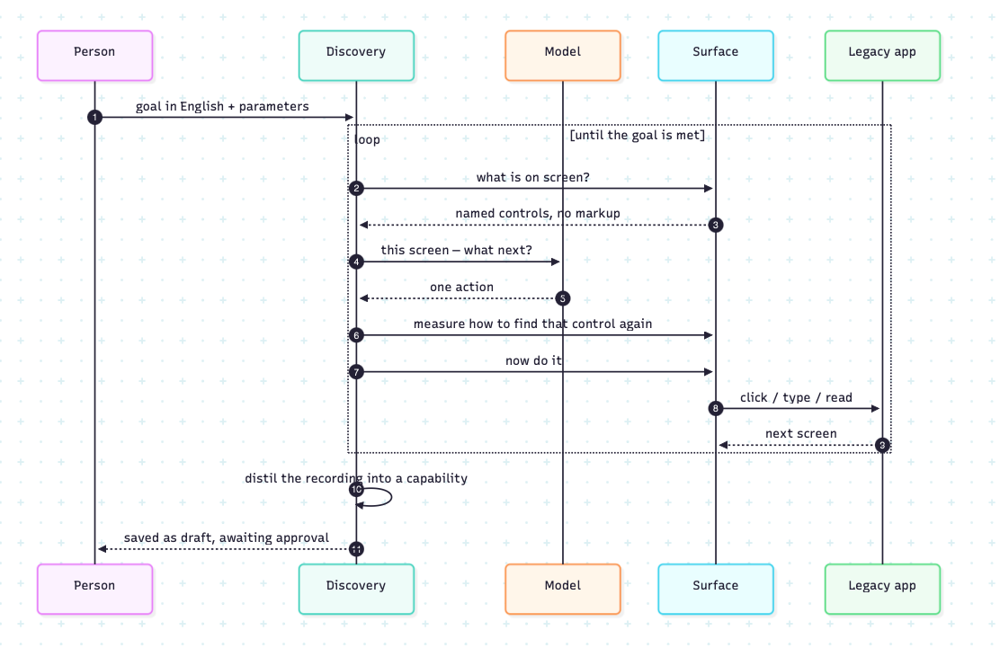
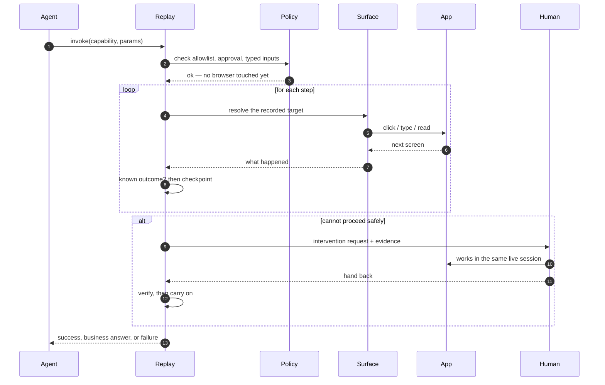
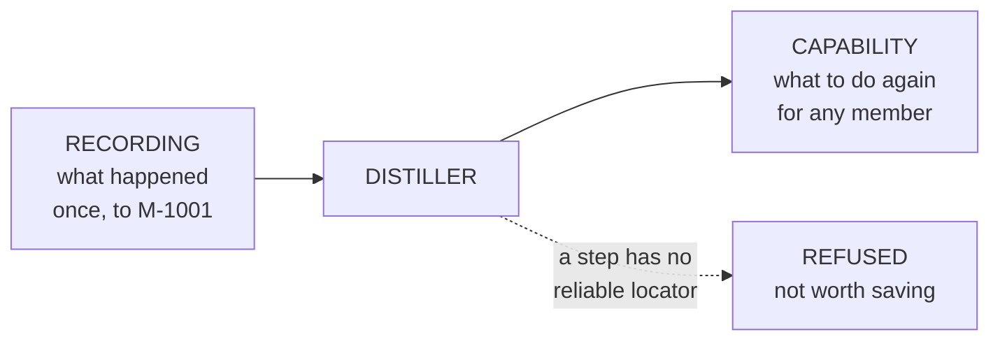

# aihands

Give an AI agent hands: let a model work out how to do a job inside a UI that has no API,
save what it did as a reusable capability, then run that capability from then on with no
model in the loop at all.

The target here is a credit union back-office desk I wrote for this — server-rendered, a
real `<frameset>`, no test ids, and records that misbehave on purpose. Two institutions run
it with different branding, which is how the cross-tenant story gets exercised rather than
described.

---

## Setup

Python 3.11 or newer. Every command below is run **from the repository root**, and the whole
sequence is verified from a fresh clone into an empty virtualenv.

```bash
git clone <this repo> && cd aihands

python3 -m venv .venv && source .venv/bin/activate
pip install -e ".[dev]"
playwright install chromium
```

That is the whole install. Then bring up the two institutions, each in its own terminal:

```bash
aihands app --tenant mendota  --port 8099   # Lake Mendota Credit Union  (Madison, WI)
aihands app --tenant presidio --port 8098   # Presidio Federal CU        (San Francisco)
```

Open <http://127.0.0.1:8099> and sign in with any operator id, e.g. `OP-77`. Reset the seeded
records at any point:

```bash
curl -X POST http://127.0.0.1:8099/admin/reset
```

Confirm the install with the test suite — it starts the target applications itself if they
are not already running:

```bash
pytest -q          # 207 tests, about 35 seconds
```

### About the API key

```bash
cp .env.example .env        # add your OPENAI_API_KEY; .env is gitignored
```

**A key is needed for discovery only, and only with `--planner ladder` or `--planner llm`.**

Everything else runs without one:

- `--planner heuristic` records a flow using deterministic rules alone, which is how the whole
  pipeline stays runnable in CI
- replay never reads the key — a test walks the live import graph and fails if the replay path
  can so much as reach a model client, and every result carries `llm_calls` so a caller can
  check rather than trust
- the full test suite passes with no key set

Every artifact records which tiers decided which steps, so a run with no model in it can never
be mistaken for a model-driven one.

### Records that misbehave, on purpose

| member | what it does |
|---|---|
| `M-1001` | the happy path |
| `M-1002` | frozen — servicing is refused |
| `M-1003` | already has a savings sub-account, so the goal is already met |
| `M-1004` | first record load 503s, the second works |
| `M-1005` | fund it over the threshold and a second approver is demanded |
| `M-9999` | does not exist |

Deposits under $25 are rejected. `POST /admin/expire` kills the session mid-flow.

---

## The demo path

Four commands, start to finish.

**1. Discover — a model drives the real UI**

```bash
aihands discover \
  --goal "Sign in to the servicing desk, find the member with the given member id, and open \
a savings sub-account for them with the given opening deposit. Then read the confirmation \
number from the receipt." \
  --entry-url http://127.0.0.1:8099/login \
  --param operator_id=OP-77 --param member_id=M-1001 --param deposit=500 \
  --output confirmation_number \
  --planner ladder \
  --distill-to mendota.member.open_savings_subaccount \
  --name "Open a savings sub-account for a member" \
  --description "Finds a member and opens a savings sub-account, returning the confirmation number."
```

`--planner llm` makes every decision a model decision. `--planner heuristic` uses only rules
and needs no API key, which is how the whole pipeline stays runnable in CI. Every artifact
records which tiers decided which steps, so an offline run can never be mistaken for a
model-driven one.

**2. Approve — because it changes state**

It comes out as `draft`. A capability that only reads replays freely; one that can open an
account needs a person to read it first.

```bash
aihands approve mendota.member.open_savings_subaccount --by you@example.com
```

**3. Replay — with parameters the recording never saw, and no model**

```bash
aihands replay mendota.member.open_savings_subaccount \
  --param operator_id=OP-77 --param member_id=M-1005 --param deposit=750 --allow-risky
```

**4. Run the same artifact against the other institution**

```bash
aihands replay mendota.member.open_savings_subaccount --tenant presidio \
  --param operator_id=OP-77 --param member_id=M-1001 --param deposit=500 --allow-risky
```

Try `M-9999` for a business answer, `M-1004` for a transient it recovers from, and
`--param deposit=15000` for the one that stops and asks for a human.

### Console and agent API

```bash
aihands console          # http://127.0.0.1:8100
```

The catalogue at `GET /api/capabilities` emits JSON Schema for inputs and outputs, so a
capability is directly usable as a tool definition. `POST /api/capabilities/{id}/invoke`
runs one. Add `"attended": true` and a stuck run waits for a person instead of returning an
intervention request.

### Tests and evidence

```bash
pytest -q                          # 207 tests
python scripts/make_evidence.py    # regenerates everything in evidence/ from real runs
```

---

## How it works

Two modes, and one file between them.



**Mode A runs once per job.** You give it a goal and the parameters. A model looks at the screen,
picks one action, we do it, and we look again — until the job is done. Then the whole
recording is boiled down into one file.

**Mode B runs every time after.** An agent hands us that file and some parameters. We follow
the saved steps. There is no model anywhere in this path — a test walks the import graph and
fails if one becomes reachable, and every result comes back stamped `llm_calls: 0`.

**The file in the middle is the product.** It is plain JSON a person can read in a pull
request: the steps, several ways to find each control, what to check after each one, what the
application may legitimately answer, and who approved it.

The reason for splitting it this way is not cost — it is **repeatability**. Ask a model the
same question twice and it may answer differently, and nobody lets that near a real account.
So the model runs once, watched, and what it worked out becomes something a reviewer can read
and a machine can repeat exactly.

---

### Mode A · Discovery



1. A person gives the goal and the parameters.
2. We read the screen and hand up **named controls** — never markup. The model refers to
   things by reference, so it could not write a selector if it wanted to.
3. Rules try to pick the next action first. They only act when exactly one thing matches.
4. If the screen is ambiguous the rules decline, and the model decides — and is told *why*
   they declined.
5. **Before acting**, we measure how that control could be found again: build every plausible
   description and run each against the live page. Only the ones matching exactly one thing
   survive. This has to happen first, because a click navigates away and the element is gone.
6. Do it, see the next screen, write down what ran.
7. When the goal is met, the recording is distilled into a capability — saved as **draft**.

<details><summary>diagram source</summary>


</details>

---

### Mode B · Replay



1. An agent asks for the capability with its parameters.
2. We check the allowlist, the approval, and the parameter types — **before opening a
   browser**, so anything wrong costs nothing to refuse.
3. Then, per step: find the control by walking the recorded descriptions best-first, act, and
   check we landed where we expected.
4. The order inside that loop matters. We ask what the application **said** before asserting
   where we **are**. "No member found" is an answer; treating it as a broken assertion would
   bury a routine result in an alert queue.
5. If we cannot safely continue, a person takes the same live browser, does the part
   automation cannot, and hands it back. We verify before carrying on.
6. One typed result: a success, a business answer, or a failure with the step, what we
   expected and what we saw.

<details><summary>diagram source</summary>


</details>

---

### The distiller



The piece between the two modes, and the one that makes a recording reusable. A recording is
a list of things that happened to one member on one afternoon; a capability is a contract.
Turning one into the other is four jobs:

| | |
|---|---|
| **Parameterise** | `"M-1001"` becomes `{{ input.member_id }}`, and `/member/M-1001` becomes a pattern. Without this the recipe can only ever open one member's record. |
| **Keep only what was measured** | Every description was tried against the live page while recording. Anything matching more than one element is dropped, and if a step has nothing left the whole run is refused rather than saved. |
| **Derive the checks** | What must be true after each step: the URL we reached, text only the right screen shows, or — for typing — that the field now holds what we typed. |
| **Infer the contract** | Types, patterns and descriptions are read off the run. A value typed on the sign-in screen is treated as a credential, so it gets no example and no pattern written into a committed file. |

It is a pure function — no browser, no model — which is why we can improve how descriptions
are chosen and re-distil last month's recordings for free, and why the judgement that matters
most here is testable without a live page.

The design decisions, the trade-offs, and the things I got wrong are in [REPORT.md](REPORT.md).
Real output from real runs is in [evidence/](evidence/).

---

## Layout

```
target_app/            the stand-in: two credit unions, one legacy codebase
policy.yaml            the deployment allowlist. The agent cannot touch it.
capabilities/          artifacts, plus per-app outcomes and per-tenant overlays
src/aihands/
  schema/              capability, outcomes, results, bindings — imports no browser
  kernel/              policy, control, redaction, evidence
  surface/             perception + Playwright — the only place a browser exists
  discovery/           planner, loop, distiller — the only place a model exists
  replay/              the production path
  api/                 agent API + operator console
evidence/runs/         committed output from real runs
```
